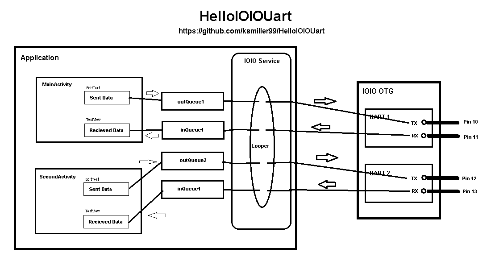

# HelloIOIOUart
This is an extension of HelloIOIOServiceIPC. I added 4 ConcurrentLinkedQueue buffers connected to two activities and two UARTs on the IOIO. The buffers are public static members of the application so all activties and the IOIO service can access and modify them.

outQueue1 takes the text entered into the EditText in MainActivity and places it in the buffer. If and when the IOIO comes online, it takes the data from outQueue1 and sends it out on Uart 1 TX (Pin 10) of the IOIO.

inQueue1 gets data from Uart 1 RX (Pin 11) of the IOIO. The data is placed there by the IOIO Service, which also sends a broadcast Intent to notify all receivers that there is data in inQueue1. When MainActivity resumes, it looks for data in inQueue1 and if there is any, it moves it to the TextView. If MainActivity is running, it listens for the Intent indicating there is data in inQueue1, and then moves it to the TextView.

SecondActivity is idenitcal to MainActivity, except that it uses outQueue2, inQueue2, and Uart2 (Pins 12 & 13) on IOIO.

The LED Off/Blink toggle button allows you to blink the LED on the IOIO for a sort of heartbeat to give visual feedback that the IOIO is online and the service is running.

This app can be used in several ways. You can connect Uart 1 TX to Uart 1 RX (Pin 10 to 11) [use a 220 - 1K ohm resistor to be safe] for a local loopback. Data sent from MainActivity will be displayed in MainActivity. Similarly , pins 12 & 13 can be conneted together to make a local loopback on SeecondActivity.

Another option is to connect pins 10 & 13 and pins 11 & 12. This will send data from Main Acitivity and vice versa.

Once you are satisfied that your app and IOIO are working, you can use this app to "chat" with other UART based serial devices by connecting the IOIO TX and RX to your devices RX & TX. Note the RX/TX cross-over connection. Also note that pins 10 - 13 have 3.3V signals and are 5V tolerant. You can use pull-up resistors to 5V if you are connecting to a TTL UART device. Be very careful that you do not connect to and signals that are not in the 0V - 5V range, such as RS232 - you'll fry your IOIO.

Please let me know of errors, omissions, or improvements, and if you found this helpful.

